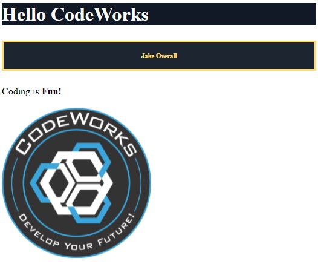

# Technical Practice Test

This practice test has been designed to help prospective students prepare for and pass the Technical Exam required for acceptance into the CodeWorks® Immersive Fullstack Course. 

Students will need to demonstrate proficiencies in each of the 5 sections below. 

Successful completion of the exam follows a three strike system. Students must complete the tasks associated with each section missing no more than 2 tasks overall.

In this repository you are provided with three starting files to demonstrate your skill. 

While the sections will not change when taking the actual exam the sub-tasks will vary so be sure to study and understand how to accomplish each of these tasks without references for the actual exam. 

1. **Writing and styling html**
   x - Use the largest heading element to render the message `Hello CodeWorks` to the page
   x - Use the smallest heading element to render your name to the page
   x - Use a paragraph element to render the short sentence `Coding is Fun!` to the page
   x - Use an element to bold only the word `Fun!` in the paragraph above
   x - Use an img element to render the following logo to the page `https://bcw.blob.core.windows.net/public/img/8600856373152463`
   x - Adjust the height of the logo to be `250px`
   x - Apply an inline-style to the largest heading to change the following
     x - change the font color to `#ffffff`
     x - change the background color to `#111927`
   x - Use a css class to apply the following styles to the smallest heading
     x - change the font color to `#ffdb6d`
     x - center the text
     x - add a border with at least 3px and the color `#ffdb6d`
     x - adjust the padding of this element to `1rem`
     x - change the background color to `#1d2531`
    - Example output  
2. **Creating and using variables in JavaScript**
   x - Create a variable called `currentYear` and set its value to the current year
   x - Create another variable called `jsReleaseYear` and set its value to `1995`
   x - Calculate and log the `current age of JavaScript is __` using the two variables above
   x - Write a conditional using the variable `ageToVote` to log
     x - When true = `JavaScript is old enough to vote`
     x - When false = `JavaScript is not old enough to vote`
     x - *change the value of `ageToVote` to 100 to ensure both messages will log*
3. **Creating and using Loops in JavaScript**
   x - Write a for i loop that will log the numbers 0-100 (*include 0 and 100*)
   x - Modify the loop to log only multiples of 10
   x - Log the word `Starting` before the loop runs
   x - Use a conditional to log the message `Halfway` when the loop hits the number `50`
   x - Log the word `Finished` when the loop concludes
4. **Accessing properties on an object in JavaScript**
   x - Use the provided `user` object and dot notation
     x - log the message `Sherlock Holmes lives at 221B Baker Street, London`
     x - ***HINT:*** [Variable Substitution String Interpolation](https://www.w3schools.com/js/js_string_templates.asp)
5. **Working with an array of objects in JavaScript**
   x - Iterate over the `cases` array and log the title and release year of each story
   x - Iterate over the `cases` array and log only the title of cases released in the year `1903`

### Good Luck!!

## Legal Overview

The content under the CodeWorks®, LLC Organization and all of the individual repos are solely intended for use by CodeWorks Instruction to deliver Educational content to CodeWorks Students.

---

## Copyright

© CodeWorks® LLC, 2021. Unauthorized use and/or duplication of this material without express and written permission from CodeWorks, LLC is strictly prohibited.

